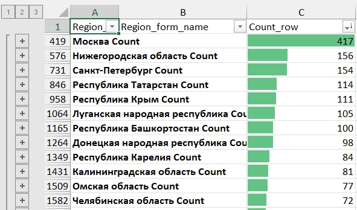
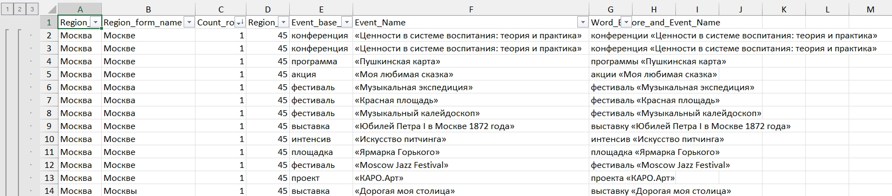

# Description
These Python scripts allow to:
- create vocabularies with all form of words using own list of Russian words in nominative form (works with all parts of speech)
- join several JSON files into one
- clean text from emojies, whitespaces and unusual characters
- search matching whole words and whole phrases from vocabularies in JSON file and count result for each matching

## Data preparation

### Download and save JSON data from Telegram channels
Data in JSON format was downloaded from Telegram directly for 11 Telegram channels using Desktop Telegram interface and saved in separate directory. Each channel has own directory with own JSON file with posts. **Sum of posts for 11 JSON files is 49714**. Period of posts is from date of channels` creation to 30.01.2024.

### Data cleaning and formatting
Python script https://github.com/romashkoyp/Telegram/blob/master/02_many_json_to_one_json.py detects JSON files in folder and subfolders, extracts only text data from these JSON files and cleans text data from emojies, whitespaces and unusual characters, creates only one JSON file with all data from all JSON files.
Clean text method is:
```
if post_text:
    full_text = ''.join(item.get('text', '') if isinstance(item, dict) else item for item in post_text)
    lines = [line for line in full_text.splitlines() if line.strip()]
    cleaned_text = ' '.join(lines)

    # Define a list of allowed symbols
    allowed_symbols = ['«', '»', '.', ',', '!', '?', ':', ';', '(', ')', '[', ']', '{', '}', '&', '@', '#', '$', '%', '^', '*', '+', '-', '=', '_', '<', '>', '|', '/', '\\']

    # Remove emojis and unwanted symbols using regex
    cleaned_text = re.sub(r'[^\w\s{}]+'.format(''.join(re.escape(symbol) for symbol in allowed_symbols)), '', cleaned_text)
    cleaned_text = re.sub(r'\s+', ' ', cleaned_text)
```

In output JSON file we get **19011 posts** with structure:
```
{
    "channel":
    "post_id":
    "global_post_id":
    "post_date":
    "post_text":
}
```
### Russian regions` vocabulary preparation
Python script https://github.com/romashkoyp/Telegram/blob/master/04_parser_translate_ru_full.py
- gets russian_regions.csv as list of names:
```
region_id ,region_name     ,region_2...
       01 ,Алтайский край  ,Барнаул...
       ...
```
- returns after banding words and phrases on translate.ru as russian_regions_translate.csv with **list of words and phrases in all possible cases without duplicates**:
```
region_id ,region_name
       01 ,Алтайский край
       01 ,Алтайского края
       01 ,Алтайскому краю
       01 ,Алтайским краем
       01 ,Алтайском крае
       01 ,Барнаул
       01 ,Барнаула
       01 ,Барнаулу
       01 ,Барнаулом
       01 ,Барнауле
        ...
```
- Python script https://github.com/romashkoyp/Telegram/blob/master/05_merge_csv.py merges 2 CSV files russian_regions.csv and russian_regions_translate.csv by ID to make single CSV russian_regions_vocabulary.csv with structure:
```
region_id ,region_name_x  ,region_name_y
        1 ,Алтайский край ,Алтайский край
        1 ,Алтайский край ,Алтайского края
        1 ,Алтайский край ,Алтайскому краю
        1 ,Алтайский край ,Алтайским краем
        1 ,Алтайский край ,Алтайском крае
        1 ,Алтайский край ,Барнаул
        1 ,Алтайский край ,Барнаула
        1 ,Алтайский край ,Барнаулу
        1 ,Алтайский край ,Барнаулом
        1 ,Алтайский край ,Барнауле
        ...
```
### Events` list preparation
- Python script https://github.com/romashkoyp/Telegram/blob/master/06_search_events_sentences.py extracts event-related information from the JSON file with all posts, specifically the text enclosed in «» symbols. It checks for specific criteria, including word count (<17 words between «» symbols) and formatting, and cross-references the extracted information with file event_vocabulary.csv: words which are expected before '«' symbol (from column word_1). 
```
word_id ,word_1
слёт    ,слёт
слёт    ,слёты
слёт    ,слёта
слёт    ,слётов
слёт    ,слёту
слёт    ,слётам
слёт    ,слётом
слёт    ,слётами
слёт    ,слёте
слёт    ,слётах
...
```
- Result is extracted in file all_events_sentences.json which represents **3989 sentences** with data structure:
```
{
    "sentence":
    "event_code":
    "word_before":
    "event_name":
    "word_before_event_name":
}
```
## Data extraction
### Counting regions and events in sentences
- Python script gets as input vocabulary of regions from russian_regions_vocabulary.csv (829 names` forms) and sentences with events from all_events_sentences.json (3989 sentences), searches in case insensitive manner all combinations in sentences where are together region name and event. Result is saved in TXT file with '*' delimiter:
```
Region_ID*Region_base_name*Region_form_name*Event_base_name*Event_Name*Word_Before_and_Event_Name
40*Санкт-Петербург*Санкт-Петербурге*конференция*«Педагог и наставник в пространстве НЕОдидактики»*конференция «Педагог и наставник в пространстве НЕОдидактики»
...
```
- After pasting data in Excel, filtering and making subtotal result looks as:



### Counting regions in posts
Python script gets as input vocabulary of regions from russian_regions_vocabulary.csv with 829 names` forms and JSON file with 19011 posts and counts each matching for each word and phrase form in JSON file. Result is saved to TXT file with '*' delimiter:
```
region_id*region_name*region_form*count
1*Алтайский край*Алтайский край*17
1*Алтайский край*Алтайского края*70
1*Алтайский край*Алтайскому краю*0
1*Алтайский край*Алтайским краем*0
1*Алтайский край*Алтайском крае*23
1*Алтайский край*Барнаул*13
1*Алтайский край*Барнаула*19
1*Алтайский край*Барнаулу*0
1*Алтайский край*Барнаулом*0
1*Алтайский край*Барнауле*11
...
```

### Counting words in posts
- Python script gets as input vocabulary of words from words_vocabulary.csv with 1391 words` forms with data structure:
```
word     ,word_form
патриот  ,патриот
патриот  ,патриоты
патриот  ,патриота
патриот  ,патриотов
патриот  ,патриоту
патриот  ,патриотам
патриот  ,патриотом
патриот  ,патриотами
...
```
- gets as input JSON file with 19011 posts and counts each matching for each word form in JSON file. Result is saved to TXT file with '*' delimiter:
```
word*word_form*count
патриот*патриот*45
патриот*патриоты*107
патриот*патриота*23
патриот*патриотов*32
патриот*патриоту*0
патриот*патриотам*1
патриот*патриотом*9
патриот*патриотами*8
...
```